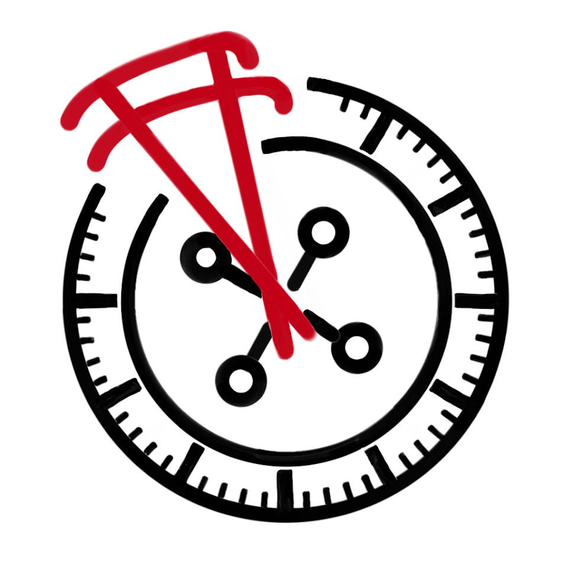
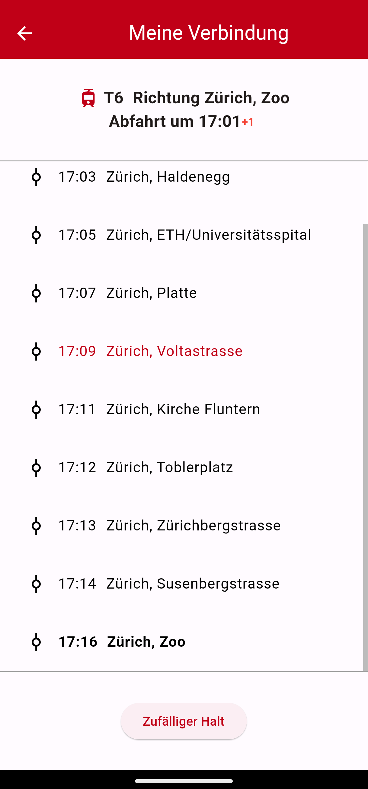

# Pantografin

Embark on a spontaneous Swiss adventure with my mobile app! Utilize your GA or Day pass to the fullest by letting Pantografin choose your mode of transport and your destination. 
Head to the nearest stop, embrace the randomness, and enjoy the ride. Once leaning back on your train, tram, bus, funicular or ship, let Pantografin decide on the best moment to hop off. 

## Some impressions

## Tech Stack

This mobile app is created with [Flutter](https://flutter.dev/), a cross-platform, open-source UI Software.

To get the realtime transportation data, the following API is used:

* [Swiss public transport API](http://transport.opendata.ch/) powered by [Opendata.ch](https://opendata.ch/)

## Comming soon

I am planning to release this app in Google Play Store at some point during this year (2024).

I also want to work on some more features like adding filtering options on the randomly chosen connections, saving the travel history and English language support (the app is currently in German).
